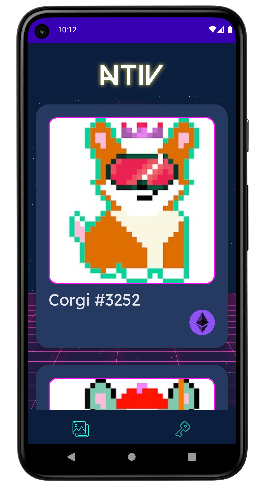
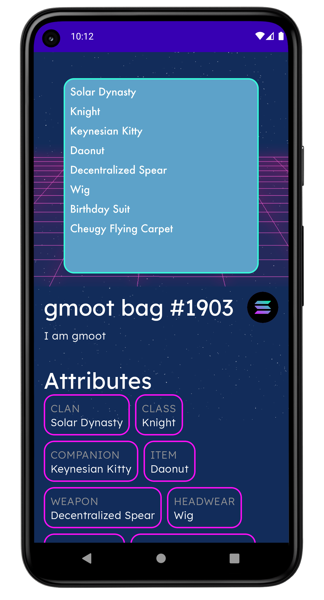

<div align="center">
    
</div>

<div align="center">
    <a href="http://makeapullrequest.com">
        
    </a>
    <a href="https://developer.android.com/jetpack/androidx/versions/all-channel#december_16_2020">
        
    </a>
    <a href="https://github.com/creativedrewy/NATIV/network/">
        
    </a>
    <a href="https://github.com/creativedrewy/NATIV/stargazers">
        
    </a>
    <a href="https://github.com/creativedrewy/NATIV/issues">
        
    </a>  
        <a href="https://github.com/creativedrewy/NATIV/blob/master/LICENSE">
        
    </a> 
    <a href="https://twitter.com/creativedrewy">
        
    </a>
</div>

<br />

# NATIV

NATIV is the best NFT Gallery app for Android, written with 100% Android native APIs and code.

## Take a Look

A new Dawn | For NFT Apps | On Android
--- | --- | --- |
 |  | 

## Supported Blockchains

Currently NATIV will display NFTs from the following blockchains:

- Ethereum
- Solana

But we don't want it to stop there; NATIV aims to be the premiere NFT gallery for all blockchains. If you want to help add support for additional blockchain, see the contributing secion.

## Technologies

NATIV is built using 100% Kotlin with all of the latest and greatest Android APIs and libraries:

- 100% Jetpack Compose UI w/ Material components
- Coroutines with Flow & StateFlow
- Room local database
- Hilt Dependency Injection
- Multi-module app
- Filament for 3d model rendering
- Blockchain APIs consumed with OkHttp

## Support

An online marketplace is coming where you will be able to support NATIV's development by purchasing some exclusive NFT merchandise, but for now you can support NATIV by sending any Solana SPL crypto to:

6aEBYFt9sX1R3rPsiYWiLK1QA5vj84Sj89wC2fNLYyMw

## Contributing

TBD

## License

```
Copyright 2021 Andrew Watson

Licensed under the Apache License, Version 2.0 (the "License");
you may not use this file except in compliance with the License.
You may obtain a copy of the License at

    https://www.apache.org/licenses/LICENSE-2.0

Unless required by applicable law or agreed to in writing, software
distributed under the License is distributed on an "AS IS" BASIS,
WITHOUT WARRANTIES OR CONDITIONS OF ANY KIND, either express or implied.
See the License for the specific language governing permissions and
limitations under the License.
```