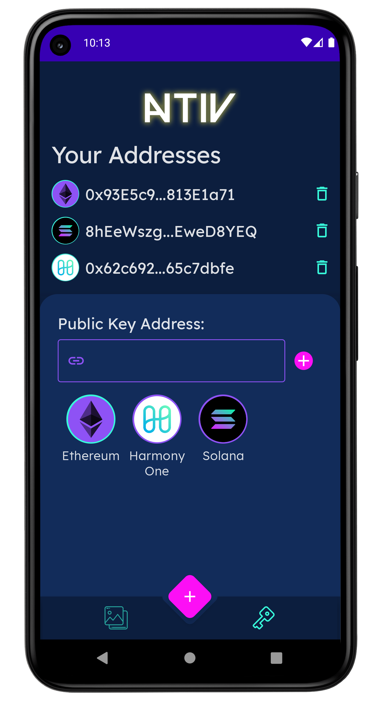

<div align="center">
    
</div>

<div align="center">
    <a href="http://makeapullrequest.com">
        
    </a>
    <a href="https://github.com/creativedrewy/NATIV/network/">
        
    </a>
    <a href="https://github.com/creativedrewy/NATIV/stargazers">
        
    </a>
    <a href="https://github.com/creativedrewy/NATIV/issues">
        
    </a>  
        <a href="https://github.com/creativedrewy/NATIV/blob/master/LICENSE">
        
    </a> 
    <a href="https://twitter.com/creativedrewy">
        
    </a>
</div>

<br />

# NATIV

NATIV lets you flex your NFTs where everyone can see them - on your phone's wallpaper!

<!--
## Take a Look

A New Dawn | For NFT Apps | On Android | For Free!
--- | --- | --- | --- |
 |  |  | 
-->

## Technologies

NATIV is built using 100% Kotlin with all the tasty Android APIs and libraries:

- 100% Jetpack Compose UI w/ Material components
- Coroutines with Flow & StateFlow
- Hilt Dependency Injection
- Multi-module app
- Room local database
- Filament for 3d model rendering
- Blockchain APIs consumed with just OkHttp & GSon

## Building & Running

```shell
git clone git@github.com:creativedrewy/NATIV.git
cd NATIV
```

When opening the project in Android Studio, be sure to select the `build.gradle.kts` file from the project root.

## License

```
Copyright 2026 Andrew Watson

Licensed under the Apache License, Version 2.0 (the "License");
you may not use this file except in compliance with the License.
You may obtain a copy of the License at

    https://www.apache.org/licenses/LICENSE-2.0

Unless required by applicable law or agreed to in writing, software
distributed under the License is distributed on an "AS IS" BASIS,
WITHOUT WARRANTIES OR CONDITIONS OF ANY KIND, either express or implied.
See the License for the specific language governing permissions and
limitations under the License.
```